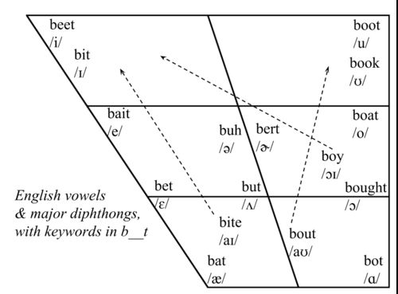

# Phonetics

This library currently provides three utilities for anyone working with the International Phonetic Alphabet:
* An index of vowels and consonants with their linguistic features
* A phonetic implementation of the Levenshtein distance calculation
* English transcriptions for ~140,000 words from a variety of sources

## Exploring vowels and consonants

Vowels are sounds with unimpeded airflow. We categorize them by the resonant frequencies they make in our vocal tract. When a person changes their tongue position or the rounding of their lips they change the way the sound reverberates in their skull. 

The primary classification for vowels is the frequency of their lowest two resonant frequencies (called 'formants'). When we plot these on an x/y axis we get a vowel chart like this:




## Phonetic Levenshtein Distance 
Using a typical 'edit distance' algorithm, we can calculate how many
orthographic changes are needed to transform one string into another.
```
require 'damerau-levenshtein'
Levenshtein.distance('coorslight', 'budlight')
=> 5
```

The `phonetics` gem provides a (very fast) implementation of an edit distance
algorithm that uses phonetic feature sets (for consonants) and precise formant
measurements (for vowels) as weights. It's a modified version of [Using
Phonologically Weighted Levenshtein Distances for the Prediction of Microscopic
Intelligibility](https://hal.archives-ouvertes.fr/hal-01474904/document) by
Lionel Fontan, Isabelle Ferrané, Jérôme Farinas, Julien Pinquier, Xavier
Aumont, 2016

With this, the input strings must be valid IPA notation and the output is a phonetic-weighted distance:

```
require 'phonetics'
Phonetics::Levenshtein.distance('kuɹzlɑɪt', 'bədlɑɪt')
=> 1.388384
```

## Contributing

Patches welcome, forks celebrated.

Everyone interacting in the Phonetics project’s codebases, issue trackers, chat rooms and mailing lists is expected to follow the [code of conduct](https://github.com/JackDanger/phonetics/blob/master/CODE_OF_CONDUCT.md).

## License

The gem is available as open source under the wide-open terms of the [MIT License](https://opensource.org/licenses/MIT).
